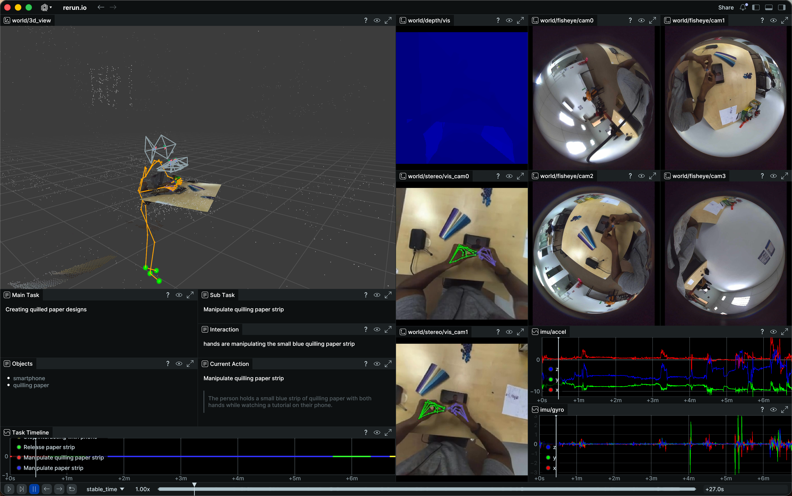

<p align="center">
  <a href="https://ropedia.com/">
    
  </a>
  <br />
  <em>Interactive Intelligence from Human Xperience</em>
</p>

# HOMIE-toolkit

Tools for **reading** and **visualizing** [Xperience-10M](https://huggingface.co/datasets/ropedia-ai/xperience-10m) data.

- Load annotation and use the data in your own scripts (export, training, custom viz)
- Reuse visualization helpers (depth colormap, skeleton, point cloud) with Rerun

## 📁 Layout

| Path | Description |
|------|-------------|
| `data_loader.py` | Load `annotation.hdf5` (calibration, SLAM, hand/body mocap, depth, IMU, point cloud); list contents and load video frames. |
| `visualization.py` | Helpers: `create_blueprint`, `depth_to_colormap`, `depth_to_pointcloud`, `build_line3d_skeleton`. |
| `examples/example_load_annotation.py` | List HDF5 contents, load annotation, inspect calibration. |
| `examples/example_visualize_rrd.py` | Log skeleton + depth to a Rerun `.rrd` file; open it with `rerun <output.rrd>`. |
| `examples/example_qwen_layered_videos.py` | Batch-process videos into per-layer alpha videos with `QwenImageLayeredPipeline`, plus preview grids and manifests. |
| `requirements-qwen-layered.txt` | Optional runtime dependencies for Qwen Image Layered video decomposition. |

## 📦 Install

```bash
python3 -m venv .venv
source .venv/bin/activate
pip install -r requirements.txt
```

### Optional: Qwen Image Layered Setup

Install a CUDA-compatible PyTorch build first, then install the layered-video extras:

```bash
pip install -r requirements-qwen-layered.txt
```

The layered-video script expects:

- `transformers>=4.51.3`
- the latest `diffusers` from GitHub
- `ffmpeg` available in `PATH`

## 🚀 Getting Started

Download sample data [here](https://huggingface.co/datasets/ropedia-ai/xperience-10m-sample), or run:

```bash
.venv/bin/python download_datasets.py
```

### 📋 List Annotations

```bash
.venv/bin/python examples/example_load_annotation.py --data_root data/xperience-10m-sample
```

Example output (top-level structure + loaded summary):

```
--- annotation.hdf5 contents (top-level) ---
  calibration: group    (cam0, cam01, cam1, cam2, cam3: K, T_c_b, ...)
  depth: group           (depth, confidence, depth_min, depth_max, scale)
  full_body_mocap: group (keypoints, contacts, body_quats, ...)
  hand_mocap: group     (left_joints_3d, right_joints_3d, mano params)
  imu: group            (device_timestamp_ns, accel_xyz, gyro_xyz, keyframe_indices)
  slam: group           (quat_wxyz, trans_xyz, frame_names, point_cloud)
  caption: ...          metadata: ...

--- Loaded data summary ---
  Frames (img_names): N
  R_c2w_all: (N, 3, 3)   t_c2w_all: (N, 3)
  Hand left/right joints: (N, 21, 3)   Full-body keypoints: (N, 52, 3)
  Contacts: (N, 21)   Depth: lazy loader, N frames   IMU: M samples

--- Calibration ---
  cam01.K, cam0–cam3 T_c_b: available

Done. Use these arrays for your own processing or pass to example_visualize_rrd.py.
```

### 🎬 Visualize with Rerun

```bash
.venv/bin/python examples/example_visualize_rrd.py --data_root data/xperience-10m-sample --output_rrd visualization.rrd
```

Then open the Rerun viewer: `rerun data/xperience-10m-sample/visualization.rrd`



## 🪄 Layer Videos with Qwen Image Layered

This repository currently contains 6 sample MP4 files under `data/xperience-10m-sample/`, each about 5822 frames long. Start with a short smoke test before running the full batch.

### Smoke Test

```bash
.venv/bin/python examples/example_qwen_layered_videos.py \
  --scan-root data/xperience-10m-sample \
  --max-videos 1 \
  --max-frames 8 \
  --frame-stride 20
```

### Full Batch

```bash
.venv/bin/python examples/example_qwen_layered_videos.py \
  --scan-root data \
  --output-root outputs/qwen-layered \
  --frame-stride 1
```

### What It Produces

For each input video, the script writes:

- `layer_00_alpha.mov`, `layer_01_alpha.mov`, ...: alpha-preserving ProRes 4444 layer videos
- `preview_grid.mp4`: original frame plus all layers over a checkerboard background
- `manifest.json`: resolved runtime settings and source metadata
- `prompts.jsonl`: prompt used for each processed frame

### Prompt Behavior

- If the video lives beside an `annotation.hdf5`, the script reuses episode caption metadata (`Main Task`, `Sub Task`, `Action`, `Objects`) to build a per-frame English prompt.
- If no annotation prompt is available, it falls back to `QwenImageLayeredPipeline(..., use_en_prompt=True)` automatic captioning.
- If GPU memory is tight, try `--enable-model-cpu-offload` and/or reduce `--max-frames` for the first run.
